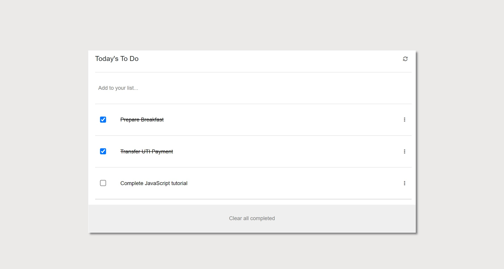

## To-do-list 


To do list is a task mangement webapp, On page load render the dynamically created list of tasks in the dedicated placeholder. The list should appear in order of the index values for each task also implemented the CRUD (create, update, delete) methods.The user will also be able to mark task completion clicking on checkbox and undo it.


## Built With

- HTML & CSS
- linters
- JavaScript
- webpack to bundle JavaScript.


## ScreenShot Demo


## Live Demo 
[Live Demo](https://monika-soam.github.io/To-do-list/dist/)


Getting Started
To get the content of this project locally you need to run this command in your terminal:

[To do list](https://github.com/monika-soam/To-do-list)
Test For tracking linter errors locally you need to follow these steps:

After cloning the project you need to run this command


## Getting started with Webpack

```
npm install webpack webpack-cli --save-dev
```

## Getting packages and debuging with Stylelint

```
npm install --save-dev stylelint@13.x stylelint-scss@3.x stylelint-config-standard@21.x stylelint-csstree-validator@1.x
```

##### For validation detection using Stylelint Run

```
npx stylelint "**/*.{css,scss}"
```

##### from parent source directory

## Getting packages and debuging with ESlint

```
npm install npm install --save-dev eslint@7.x eslint-config-airbnb-base@14.x eslint-plugin-import@2.x babel-eslint@10.x
```

##### For validation detection using Stylelint Run

```
npx eslint .
```

##### from parent source directory

## Getting packages and debuging with Webhint

```
npm init -y
npm install --save-dev hint@6.x
```

##### For validation detection using Webhint, Run

```
npx hint .
```

##### To Compile and See a live Version,  Run
```
npm run build 
```
```
npm start
```
##### To run and see test file, Run

```
npm run test
```

👤 **Monika**

- GitHub: [GitHub](https://github.com/monika-soam)
- Twitter: @monikasoam
- LinkedIn: [LinkedIn](linkedin.com/in/monika-soam-✓-16b59925)


🤝 **Contributing**

Contributions, issues, and feature requests are welcome!

Feel free to check the [issues page](https://github.com/monika-soam/To-do-list/issues).

## Show your support

Give a ⭐️ if you like this project! and advice me where to work upon it


## 📝 License

This project is [MIT](./MIT.md) licensed.

